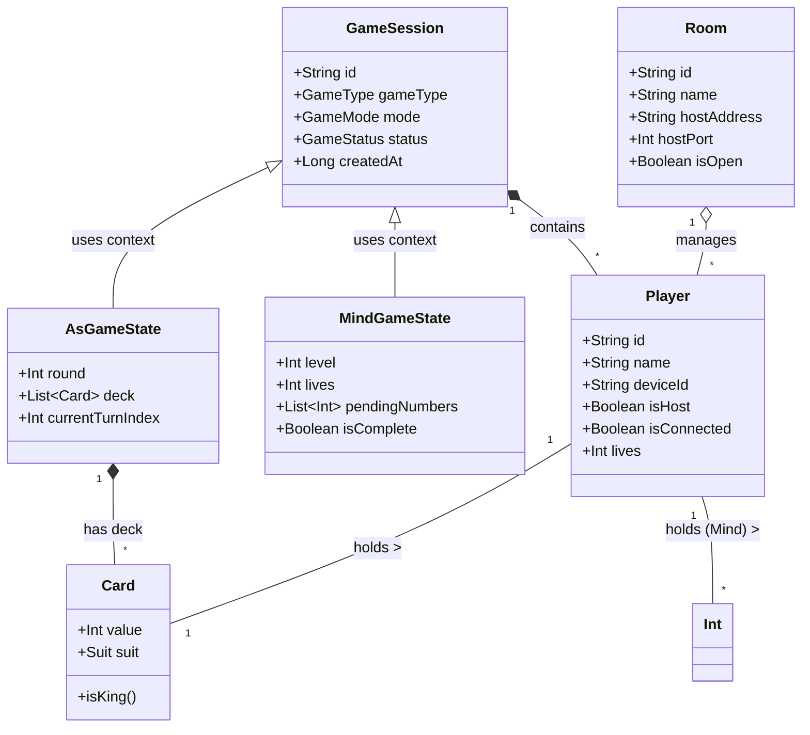
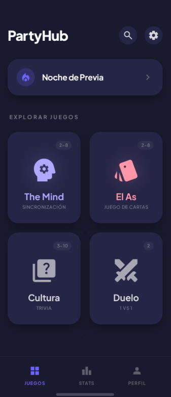
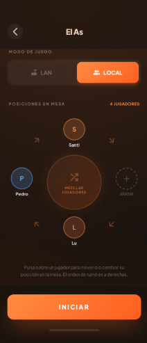
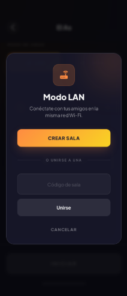
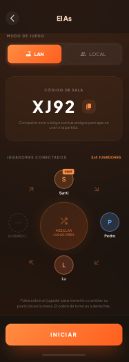
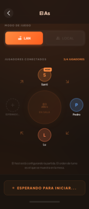

# Entrega 1 - PartyHub 🎮

**Asignatura:** Desarrollo de Aplicaciones para Dispositivos Móviles
**Curso:** 2025-2026

---

## 1. Descripción del Sistema 📱

**PartyHub** es una plataforma móvil diseñada para facilitar la interacción social a través de juegos multijugador en grupo. La aplicación actúa como un "hub" centralizado que ofrece una colección de minijuegos diseñados específicamente para reuniones sociales.

### Características Principales
*   **Modo Local:** Múltiples jugadores comparten un único dispositivo para jugar (hot-seat o pantalla compartida).
*   **Modo LAN:** Multijugador en red local donde un dispositivo actúa como Host y otros se unen como Clientes, sin necesidad de conexión a Internet.
*   **Juegos Incluidos:**
    *   *The Mind:* Juego cooperativo de sincronización mental.
    *   *El As:* Juego de cartas de eliminación y faroleo.

---

## 2. Diagrama de Casos de Uso 📋

El sistema permite a los usuarios (Local, Host, Cliente) interactuar con el Hub y los juegos específicos.

```mermaid
usecaseDiagram
    actor "Jugador Local" as JL
    actor "Jugador LAN (Host)" as JH
    actor "Jugador LAN (Cliente)" as JC

    package "PartyHub" {
        usecase "Seleccionar Juego" as UC1
        usecase "Volver al Hub" as UC2
        
        package "Configuración" {
            usecase "Iniciar Partida Local" as UC3
            usecase "Crear Sala LAN" as UC4
            usecase "Unirse a Sala LAN" as UC5
        }

        package "Juegos" {
            usecase "Jugar Ronda" as UC6
            usecase "Avanzar Nivel" as UC7
            usecase "Game Over" as UC8
            usecase "Realizar Jugada/Acción" as UC9
        }
    }

    JL --> UC1
    JL --> UC3
    JL --> UC6
    JL --> UC9

    JH --> UC1
    JH --> UC4
    JH --> UC6
    JH --> UC9

    JC --> UC1
    JC --> UC5
    JC --> UC6
    JC --> UC9

    UC3 ..> UC6 : include
    UC4 ..> UC6 : include
    UC5 ..> UC6 : include
```

---

## 3. Diagrama de Clases (Modelo de Datos) 📐

El modelo de datos se estructura en torno a la sesión de juego y los estados específicos de cada minijuego.



---

## 4. Diagrama de Arquitectura (MVVM) 🏗️

La aplicación sigue una arquitectura **MVVM (Model-View-ViewModel)** con una capa de red separada para la gestión de partidas LAN.

```mermaid
graph TD
    subgraph Presentation_Layer
        View[View (Fragment / Compose)]
        ViewModel[ViewModel]
    end

    subgraph Domain_Layer
        Engine[Game Engine (Lógica Pura)]
        UseCase[Use Cases]
    end

    subgraph Data_Layer
        Repo[Game Repository]
        Prefs[Preferences]
    end

    subgraph Network_Layer
        LAN[LAN Manager]
        Socket[Socket Handler]
    end

    View -->|Observa| ViewModel
    ViewModel -->|Llama| UseCase
    UseCase -->|Ejecuta| Engine
    UseCase -->|Solicita datos| Repo
    UseCase -->|Gestiona red| LAN
    
    LAN -->|Usa| Socket
    Repo -->|Persiste| Prefs
```

---

## 5. Prototipado (Diseño UI) 🎨

A continuación se muestran los prototipos de las interfaces principales de la aplicación.

### 5.1. Hub Principal
Pantalla de inicio donde se seleccionan los juegos.



### 5.2. The Mind
Interfaz para el juego de sincronización mental.

| Configuración Local | Selección LAN |
|---------------------|---------------|
|  |  |

| Vista Admin (LAN) | Vista Jugador (LAN) |
|-------------------|---------------------|
|  |  |

### 5.3. El As
Interfaz para el juego de cartas.

| Configuración Local | Selección LAN |
|---------------------|---------------|
|  |  |

| Vista Admin (LAN) | Vista Jugador (LAN) |
|-------------------|---------------------|
|  |  |
